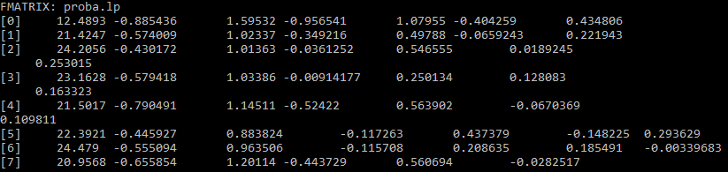
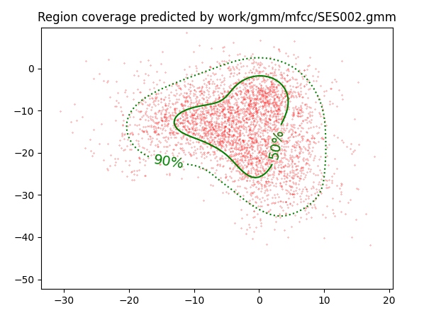
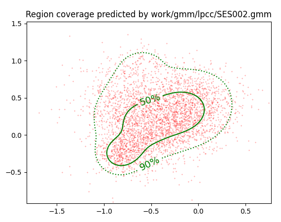

PAV - P4: reconocimiento y verificación del locutor
===================================================

Obtenga su copia del repositorio de la práctica accediendo a [Práctica 4](https://github.com/albino-pav/P4)
y pulsando sobre el botón `Fork` situado en la esquina superior derecha. A continuación, siga las
instrucciones de la [Práctica 2](https://github.com/albino-pav/P2) para crear una rama con el apellido de
los integrantes del grupo de prácticas, dar de alta al resto de integrantes como colaboradores del proyecto
y crear la copias locales del repositorio.

También debe descomprimir, en el directorio `PAV/P4`, el fichero [db_8mu.tgz](https://atenea.upc.edu/mod/resource/view.php?id=3508877?forcedownload=1)
con la base de datos oral que se utilizará en la parte experimental de la práctica.

Como entrega deberá realizar un *pull request* con el contenido de su copia del repositorio. Recuerde
que los ficheros entregados deberán estar en condiciones de ser ejecutados con sólo ejecutar:

~~~~~~~~~~~~~~~~~~~~~~~~~~~~~~~~~~~~~~~~~~~~~~~~~~~~~.sh
  make release
  run_spkid mfcc train test classerr verify verifyerr
~~~~~~~~~~~~~~~~~~~~~~~~~~~~~~~~~~~~~~~~~~~~~~~~~~~~~

Recuerde que, además de los trabajos indicados en esta parte básica, también deberá realizar un proyecto
de ampliación, del cual deberá subir una memoria explicativa a Atenea y los ficheros correspondientes al
repositorio de la práctica.

A modo de memoria de la parte básica, complete, en este mismo documento y usando el formato *markdown*, los
ejercicios indicados.

## Ejercicios.

### SPTK, Sox y los scripts de extracción de características.

- Analice el script `wav2lp.sh` y explique la misión de los distintos comandos involucrados en el *pipeline*
  principal (`sox`, `$X2X`, `$FRAME`, `$WINDOW` y `$LPC`). Explique el significado de cada una de las 
  opciones empleadas y de sus valores.

 sox es el comando principal de extracción de carateristicas: 
  sox $inputfile -t raw -e signed -b 16 - | $X2X +sf | $FRAME -l 240 -p 80 | $WINDOW -l 240 -L 240 | $LPC -l 240 -m $lpc_order > $base.lp
  Para poder saber que hace cada comando hemos consultado con el manual de SPTK.
  Las primeras opciones corresponden a las opciones del fichero de entrada. 
  La opción -t corresponde al tipo de archivo de audio, la opción -e al tipo de encoding, en nuestro caso signed.
  -b 16 ens informa que la mida de la mostra es de 16 bits.
  X2X convierte la señal de su formato en el input a otro tipo de formato, y lo envia a un standard output. En nuestro caso lo concertimos a short.
  El comando FRAME convierte una sequencia de señales input a una serie de frames (que pueden estar sobrepuestos) con en nuestro caso, longitud 240 y periodo 80.
  La opción WINDOW enventana la señal con una ventana de Blackman de longitud 240
  LPC calcula los coeficientes de predicción lineal de tamaño 240 y de orden el de la variable lpc_order, los coeficientes se escriben en el fichero base.lp.

- Explique el procedimiento seguido para obtener un fichero de formato *fmatrix* a partir de los ficheros de
  salida de SPTK (líneas 45 a 47 del script `wav2lp.sh`).

ncol=$((lpc_order+1)) # lpc p =>  (gain a1 a2 ... ap) 
nrow=`$X2X +fa < $base.lp | wc -l | perl -ne 'print $_/'$ncol', "\n";'`

Las filas de nuestra matriz corresponden a las tramas y las columnas a los Coeficientes. 

Para calcular las columnas cogemos el orden del lpc +1 , porque no podemos tener en cuenta el primer elemento , ya que se usa para guardar la ganancia del predictor.

Seguidamente, para calcular las filas, convertimos la señal a ASCII mediante la opción +fa, wc -l cuenta las filas del fichero y utilizamos el comando perl, programa que se utiliza para la manipulación de cadenas de caracteres.

  * ¿Por qué es conveniente usar este formato (u otro parecido)? Tenga en cuenta cuál es el formato de entrada y cuál es el de resultado.
  
   

Nos permite ver en cada columna (entre corchetes) el numero de cada trama, y en cada columna los coeficientes ordenados.

- Escriba el *pipeline* principal usado para calcular los coeficientes cepstrales de predicción lineal
  (LPCC) en su fichero <code>scripts/wav2lpcc.sh</code>:

sox $inputfile -t raw -e signed -b 16 - | $X2X +sf | $FRAME -l 240 -p 80 | $WINDOW -l 240 -L 240 |
  $LPC -l 240 -m $lpc_order | $LPCC -m $lpc_order -M $lpcc_order > $base.lp

- Escriba el *pipeline* principal usado para calcular los coeficientes cepstrales en escala Mel (MFCC) en su
  fichero <code>scripts/wav2mfcc.sh</code>:

sox $inputfile -t raw -e signed -b 16 - | $X2X +sf | $FRAME -l 240 -p 80 | $WINDOW -l 240 -L 240 |
  $MFCC -s 8 -w 0 -l 240 -m $mfcc_order -n $filter_bank_order > $base.mfcc
### Extracción de características.

- Inserte una imagen mostrando la dependencia entre los coeficientes 2 y 3 de las tres parametrizaciones para todas las señales de un locutor.
  
  

  + Indique **todas** las órdenes necesarias para obtener las gráficas a partir de las señales 
    parametrizadas.

  lp: 
plot_gmm_feat -x 2 -y 3 -g green work/gmm/lp/SES002.gmm work/lp/BLOCK00/SES002/SA002S*

lpcc:
plot_gmm_feat -x 2 -y 3 -g green work/gmm/lpcc/SES002.gmm work/lpcc/BLOCK00/SES002/SA002S*

mfcc:
plot_gmm_feat -x 2 -y 3 -g green work/gmm/mfcc/SES002.gmm work/mfcc/BLOCK00/SES002/SA002S*

  + ¿Cuál de ellas le parece que contiene más información?

Las graficas que mas información contienen son las de mfcc y lpcc porque son las que más dispersos tienen los puntos, es decir estan mas incorreladas.
Si nos fijamos, la grafica de lp tiene mucha mas densidad de puntos en la zona del 50%, que la lpcc y la mfcc.

- Usando el programa <code>pearson</code>, obtenga los coeficientes de correlación normalizada entre los parámetros 2 y 3 para un locutor, y rellene la tabla siguiente con los valores obtenidos.
  
  

  

  

  |                        | LP          | LPCC        | MFCC     |
  |------------------------|:-----------:|:-----------:|:--------:|
  | &rho;x[2,3] |   -0,815983 |  0,204709   | -0,187077|   |
  
  + Compare los resultados de <code>pearson</code> con los obtenidos gráficamente.
  
- Según la teoría, ¿qué parámetros considera adecuados para el cálculo de los coeficientes LPCC y MFCC?

Para calcular LPCC se necesitan como mínimo 13 coeficientes, y para MFCC se necesitan 13 coeficientes y entre 24 y 40 filtros.

### Entrenamiento y visualización de los GMM.

Complete el código necesario para entrenar modelos GMM.

- Inserte una gráfica que muestre la función de densidad de probabilidad modelada por el GMM de un locutor para sus dos primeros coeficientes de MFCC.
  
- Inserte una gráfica que permita comparar los modelos y poblaciones de dos locutores distintos (la gŕafica
  de la página 20 del enunciado puede servirle de referencia del resultado deseado). Analice la capacidad
  del modelado GMM para diferenciar las señales de uno y otro.

### Reconocimiento del locutor.

Complete el código necesario para realizar reconociminto del locutor y optimice sus parámetros.

- Inserte una tabla con la tasa de error obtenida en el reconocimiento de los locutores de la base de datos SPEECON usando su mejor sistema de reconocimiento para los parámetros LP, LPCC y MFCC.

  |               | LP   | LPCC | MFCC |
  |---------------|:----:|:----:|:----:|
  | Tasa de error |      |      |      |
  | Tasa de error | 10.57% | 0.64% | 1.66% |

### Verificación del locutor.
  

Complete el código necesario para realizar verificación del locutor y optimice sus parámetros.

- Inserte una tabla con el *score* obtenido con su mejor sistema de verificación del locutor en la tarea de verificación de SPEECON. La tabla debe incluir el umbral óptimo, el número de falsas alarmas y de pérdidas, y el score obtenido usando la parametrización que mejor resultado le hubiera dado en la tarea de reconocimiento.
 

 |                 | LP | LPCC | MFCC |
  |-----------------|:----:|:----:|:----:|
  | Umbral óptimo   | xx | xx | xx |
  | Pérdidas        | xx/250 = xx | xx/250 = xx | xx/250 = xx |
  | Falsas Alarmas  | xx/1000 = 0 | xx/1000 = xx | xx/1000 = xx|
  | Cost Detection  | xx | xx | xx |
  | Umbral óptimo   | 0.517695239607905 | 0.276933713207707 | 0.390129901113577 |
  | Pérdidas        | 92/250 = 0.3680 | 7/250 = 0.0280 | 17/250 = 0.0680 |
  | Falsas Alarmas  | 13/1000 = 0.0130 | 1/1000 = 0.0010 | 2/1000 = 0.0020|
  | Cost Detection  | 60.8 | 13.9 | 17.7 |

### Test final

- Adjunte, en el repositorio de la práctica, los ficheros `class_test.log` y `verif_test.log` 
  correspondientes a la evaluación *ciega* final.

### Trabajo de ampliación.

- Recuerde enviar a Atenea un fichero en formato zip o tgz con la memoria (en formato PDF) con el trabajo 
  realizado como ampliación, así como los ficheros `class_ampl.log` y/o `verif_ampl.log`, obtenidos como 
  resultado del mismo.
